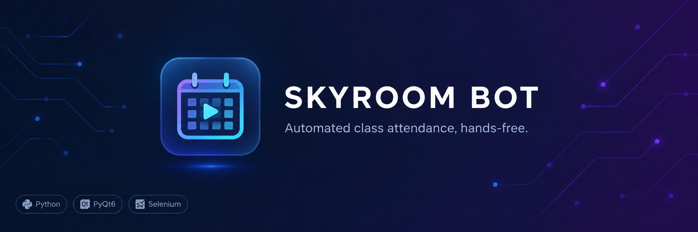

<div align="center" dir="rtl">



# ربات اسکای‌روم

ورود خودکار به کلاس‌های آنلاین اسکای‌روم، بدون اینکه لازم باشد خودتان پای سیستم باشید

<br/>

[](https://github.com/amirrezesf/SkyroomBot/actions/workflows/build.yml)
[](https://github.com/amirrezesf/SkyroomBot/releases/latest)
[](LICENSE)
[](#دانلود)

</div>

---

<div dir="rtl">

## فهرست

* [این برنامه چیست؟](#این-برنامه-چیست)
* [ربات چه کارهایی می‌کند؟](#ربات-چه-کارهایی-میکند)
* [کدام نسخه را بگیرم؟](#کدام-نسخه-را-بگیرم)
* [دانلود](#دانلود)
* [پیش‌نیازها](#پیشنیازها)
* [نصب و اجرا](#نصب-و-اجرا)
* [حالت زنده (فقط نسخه‌ی کامل)](#حالت-زنده-فقط-نسخهی-کامل)
* [حریم خصوصی](#حریم-خصوصی)
* [معماری](#معماری)
* [مجوز](#مجوز)

## این برنامه چیست؟

اگر چند کلاس آنلاین دارید و باید هر بار سر ساعت وارد اسکای‌روم شوید، این ربات می‌تواند این کار را به‌جای شما انجام دهد.

برنامه‌ی هفتگی کلاس‌ها را یک بار به ربات می‌دهید و از آن به بعد خودش سر ساعت وارد کلاس می‌شود. برای ورود از مرورگر در حالت ناشناس استفاده می‌کند، اسم شما را ثبت می‌کند و پیام حضور را می‌فرستد. در ساعت پایانی که برای کلاس مشخص کرده‌اید هم خودش از کلاس خارج می‌شود.

حتی لازم نیست لپ‌تاپ همیشه روشن باشد. ربات می‌تواند سیستم را بخواباند و قبل از شروع کلاس بعدی دوباره بیدارش کند.

## ربات چه کارهایی می‌کند؟

* ورود خودکار به کلاس، با کمی تأخیر تصادفی
* اجرای چند کاربر در یک برنامه
* بررسی اتصال WebSocket و ورود دوباره‌ی کامل در صورت قطع شدن اتصال
* ورود به کلاس حتی اگر ربات را بعد از شروع کلاس روشن کرده باشید
* فرستادن پیام حضور و خروج خودکار از کلاس
* خواباندن سیستم و بیدار کردن آن قبل از کلاس بعدی
* تقویم هفتگی فارسی و ذخیره‌ی تنظیمات

## کدام نسخه را بگیرم؟

هر نسخه در دو نوع منتشر می‌شود: `base` و `full`.

**نسخه‌ی پایه (base)** همان ربات اصلی است و همه‌ی امکانات بالا را دارد. فقط یک فایل اجرایی سبک است و اگر فقط می‌خواهید ربات به‌جای شما در کلاس حاضر شود، همین نسخه کافی است.

**نسخه‌ی کامل (full)** همه‌ی امکانات نسخه‌ی پایه را دارد و علاوه بر آن، Jarvis هم در آن قرار گرفته است.

Jarvis صدای کلاس را گوش می‌دهد و حرف‌های استاد را به متن تبدیل می‌کند. اگر اسم شما گفته شود یا استادی دستوری بدهد که نیاز به انجام کاری داشته باشد، آن را تشخیص می‌دهد و قبل از اجرا در یک صف تأیید به شما نشان می‌دهد. تا وقتی تأیید نکنید، هیچ کاری انجام نمی‌شود.

تنظیمات Jarvis هم از داخل رابط گرافیکی برنامه قابل انجام است.

## دانلود

آخرین نسخه را می‌توانید از صفحه‌ی [Releases](https://github.com/amirrezesf/SkyroomBot/releases/latest) دانلود کنید.

| پلتفرم          | نسخه | فایل                                 | حجم تقریبی  |
| --------------- | ---- | ------------------------------------ | ----------- |
| ویندوز (x86-64) | پایه | `SkyroomBot-*-windows-x64.exe`       | ۵۰ مگابایت  |
| ویندوز (x86-64) | کامل | `SkyroomBot-*-windows-x64-full.zip`  | ۲۵۰ مگابایت |
| لینوکس (x86-64) | پایه | `SkyroomBot-*-linux-x64`             | ۵۰ مگابایت  |
| لینوکس (x86-64) | کامل | `SkyroomBot-*-linux-x64-full.tar.gz` | ۲۵۰ مگابایت |

فایل `SHA256SUMS` هم کنار فایل‌های دانلود قرار دارد که در صورت نیاز بتوانید صحت فایل دانلودشده را بررسی کنید.

نسخه‌ی پایه فقط یک فایل اجرایی است و مستقیم اجرا می‌شود. نسخه‌ی کامل به‌صورت آرشیو منتشر شده و قبل از اجرا باید آن را از حالت فشرده خارج کنید.

## پیش‌نیازها

تنها چیزی که باید روی سیستم نصب باشد **Google Chrome** است. `chromedriver` مناسب داخل خود برنامه قرار دارد و لازم نیست Python، Selenium یا چیز دیگری نصب کنید.

* ویندوز ۱۰ یا جدیدتر (x86-64)
* لینوکس x86-64 با glibc نسخه‌ی 2.31 یا بالاتر (Ubuntu 20.04، Fedora 32، Debian 11 و نسخه‌های جدیدتر)

### فقط برای نسخه‌ی کامل

در اولین اجرای حالت شنونده، چند مورد دانلود می‌شود:

* مدل `Whisper large-v3` از Hugging Face، حدود ۳ گیگابایت
* کتابخانه‌های CUDA، حدود ۱ گیگابایت؛ فقط در صورت داشتن کارت گرافیک NVIDIA استفاده می‌شود
* Ollama برای استخراج دستورها روی سیستم خودتان؛ این مورد اختیاری است و جداگانه نصب می‌شود

این دانلودها فقط بار اول انجام می‌شوند. بعد از آن پردازش‌ها به‌صورت محلی و آفلاین انجام می‌شوند.

## نصب و اجرا

<details>
<summary>ویندوز، نسخه‌ی پایه</summary>

1. فایل `SkyroomBot-*-windows-x64.exe` را دانلود کنید.
2. فایل را در هر پوشه‌ای که خواستید قرار دهید و اجرا کنید.
3. اگر Windows SmartScreen هشدار داد، روی **More info** و بعد **Run anyway** بزنید. برنامه امضای دیجیتال ندارد.
4. بار اول از منوی «پرونده ← بارگذاری فایل JSON…» فایل برنامه‌ی هفتگی را انتخاب کنید.

تنظیمات در `%APPDATA%\SkyroomBot\` ذخیره می‌شود.

</details>

<details>
<summary>ویندوز، نسخه‌ی کامل</summary>

1. فایل `SkyroomBot-*-windows-x64-full.zip` را دانلود و در یک پوشه باز کنید.
2. وارد پوشه‌ی `SkyroomBot\` شوید و `SkyroomBot.exe` را اجرا کنید.
3. بار اول از منوی «پرونده ← بارگذاری فایل JSON…» فایل برنامه‌ی هفتگی را انتخاب کنید.
4. برای فعال کردن حالت زنده، در JSON هر کلاس کلید `"live": true` را اضافه کنید. توضیحات بیشتر در بخش «حالت زنده» آمده است.

</details>

<details>
<summary>لینوکس، نسخه‌ی پایه</summary>

1. فایل `SkyroomBot-*-linux-x64` را دانلود کنید.
2. فایل را قابل اجرا کنید و اجرا کنید:

```bash
chmod +x SkyroomBot-*-linux-x64
./SkyroomBot-*-linux-x64
```

3. بار اول از منوی «پرونده ← بارگذاری فایل JSON…» فایل برنامه‌ی هفتگی را انتخاب کنید.

تنظیمات در `~/.config/SkyroomBot/` ذخیره می‌شود.

</details>

<details>
<summary>لینوکس، نسخه‌ی کامل</summary>

1. فایل `SkyroomBot-*-linux-x64-full.tar.gz` را دانلود کنید.
2. آرشیو را باز کنید و برنامه را اجرا کنید:

```bash
tar -xzf SkyroomBot-*-linux-x64-full.tar.gz
cd SkyroomBot
./SkyroomBot
```

3. بار اول از منوی «پرونده ← بارگذاری فایل JSON…» فایل برنامه‌ی هفتگی را انتخاب کنید.
4. برای فعال کردن حالت زنده، در JSON هر کلاس کلید `"live": true` را اضافه کنید.

</details>

---

## حالت زنده (فقط نسخه‌ی کامل)

حالت زنده را می‌توانید برای هر کلاس جداگانه فعال کنید.

در فایل JSON برای کاربر یک `field` قرار دهید و برای هر کلاسی که می‌خواهید شنونده‌ی آن فعال باشد، `"live": true` بگذارید:

```json
[
    {
        "user_name": "امیررضا اسفندیاری",
        "field": "Health Information Technology",
        "classes": [
            {
                "name": "کد گذاری مرگ و میر 2",
                "url": "https://vc8.ajums.ac.ir/ch/piraminicare",
                "day": "سه‌شنبه",
                "time": "10:00am",
                "end_time": "12:00pm",
                "live": true
            }
        ]
    }
]
```

کلاس‌هایی که `"live": true` نداشته باشند، مثل نسخه‌ی پایه و بدون شنونده اجرا می‌شوند.

### کار با آن

1. برنامه را باز کنید و به تب «جارویس» بروید.
2. از بخش «تنظیمات»، مدل، بک‌اند استخراج و دستگاه ضبط صدا را انتخاب کنید.
3. فایل JSON را بارگذاری کنید و روی «شروع» بزنید.
4. ربات وارد کلاس می‌شود و شنونده هم شروع به کار می‌کند.

در طول کلاس، متن صحبت‌های استاد همان لحظه در تب جارویس نمایش داده می‌شود. اگر استاد اسم شما را بگوید یا دستوری بدهد، یک پیشنهاد در ستون کناری نمایش داده می‌شود.

`Enter` برای تأیید و `Esc` برای رد کردن پیشنهاد است.

## حریم خصوصی

پردازش صدا روی همان سیستم خودتان انجام می‌شود و صدای خام کلاس ذخیره نمی‌شود.

فقط متن پیاده‌شده و تصمیم‌ها در `~/.jarvis/logs/` ذخیره می‌شوند.

اگر بک‌اند استخراج را روی `cloud` بگذارید، متن برای سرور 9Router محلی شما فرستاده می‌شود.

## معماری

ساختار پروژه را عمداً به چند بخش جدا تقسیم کردم تا منطق اصلی ربات وابسته به رابط کاربری نباشد.

```text
                    ┌─────────────────────┐
                    │       PyQt6 UI      │
                    │  pyqt.py            │
                    └──────────┬──────────┘
                               │
                               ▼
                    ┌─────────────────────┐
                    │   Skyroom Core      │
                    │  skyroom_core.py    │
                    │                     │
                    │  • زمان‌بندی کلاس‌ها │
                    │  • مدیریت Threadها  │
                    │  • Selenium         │
                    │  • WebSocket        │
                    └───────┬─────────────┘
                            │
                 ┌──────────┴──────────┐
                 ▼                     ▼
        ┌─────────────────┐   ┌────────────────────┐
        │  Chrome/Selenium│   │ Jarvis Integration │
        └─────────────────┘   │ jarvis_integration │
                              └─────────┬──────────┘
                                        │
                                        ▼
                              ┌────────────────────┐
                              │       Jarvis       │
                              │ Whisper → Commands │
                              │        → Queue     │
                              └────────────────────┘
```

### چند نکته‌ی مهم

* `skyroom_core.py` هیچ وابستگی‌ای به PyQt ندارد. زمان‌بندی، مدیریت Threadها و کنترل مرورگر در این بخش انجام می‌شود و تست‌های آن هم جدا از رابط کاربری هستند.
* برای هر کلاس یک Thread جدا وجود دارد. با `stop_event` می‌توان همه‌ی Threadها را متوقف کرد.
* Jarvis مستقیماً با Selenium کار نمی‌کند. دستورهایش از طریق `queue.Queue` به Thread مربوط به کلاس فرستاده می‌شوند؛ چون Selenium باید از همان Threadای استفاده شود که Driver در آن ساخته شده است.
* برای تشخیص قطع شدن اتصال، یک اسکریپت JavaScript وضعیت WebSocketهای صفحه را بررسی می‌کند. این کار جلوی ورود دوباره‌ی بی‌دلیل ربات را می‌گیرد.
* اگر پکیج Jarvis در دسترس نباشد، `JARVIS_AVAILABLE=False` می‌شود و تب Jarvis ساخته نمی‌شود. در این حالت ربات مثل نسخه‌ی پایه بدون قابلیت شنونده کار می‌کند.
* `wake_scheduler.py` هم جدا از بخش اصلی اجرا می‌شود و زمان بیدار شدن سیستم برای کلاس بعدی را با `rtcwake` در لینوکس یا Task Scheduler در ویندوز تنظیم می‌کند.


## مجوز

برای اطلاعات مربوط به مجوز، فایل [LICENSE](LICENSE) را ببینید.

</div>
